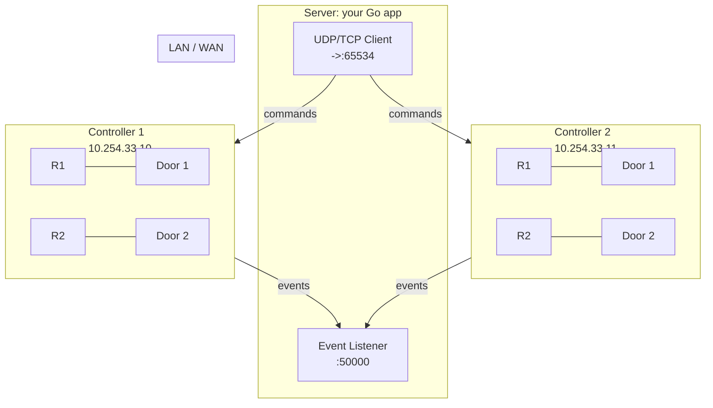
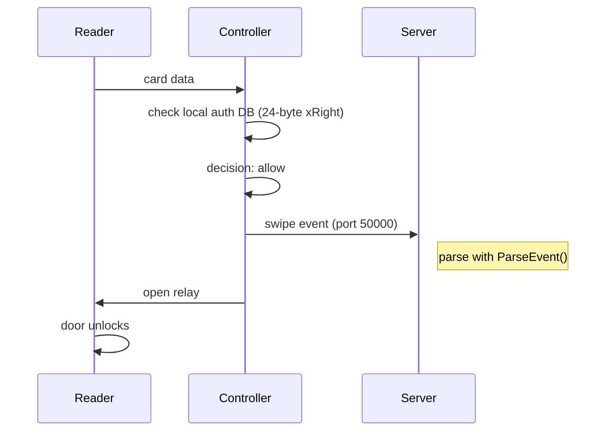
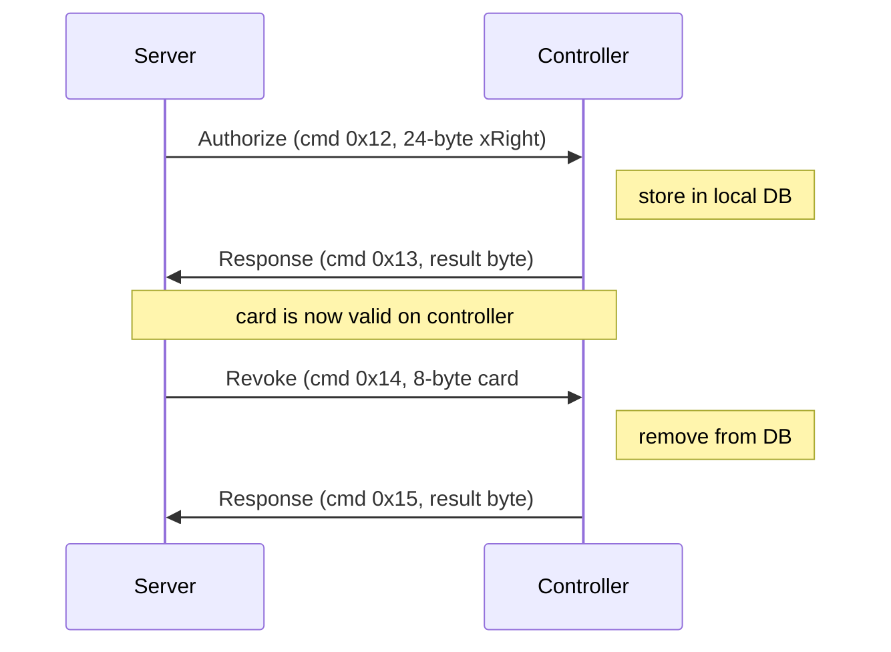
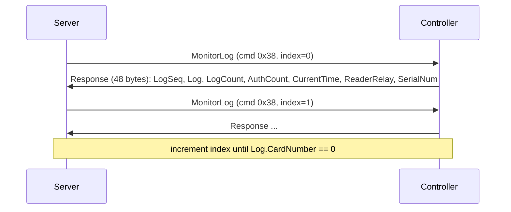

# go-s4a

Go SDK for S4A ACB series door access controllers (JL-IDD-Z4 OEM protocol).

```
github.com/sonroyaalmerol/go-s4a
```

Requires Go 1.26. MIT licensed.

## How It Works

A door access control system has three layers: **controllers** (hardware at each door), a **server** (your application -- replacing the original Windows S4A software), and **readers** (card scanners, keypads, ID readers wired to controllers).

### Network Topology



Each controller manages 1-4 doors and up to 8 readers (4 serial + 4 Wiegand). The controller is the decision maker: it verifies card authorizations locally against its stored card database.

### Two-Channel Communication

Controllers use **two ports** with distinct roles:

| Channel  | Port  | Direction           | Purpose                                                      |
| -------- | ----- | ------------------- | ------------------------------------------------------------ |
| Events   | 50000 | Controller → Server | Real-time card swipes, heartbeat, signal changes, async logs |
| Commands | 65534 | Server → Controller | Open door, authorize/revoke cards, set time, configure       |

**Events (port 50000):** The controller actively pushes events to the server. The server listens on this port. This is the only way to receive card swipes in real time.

**Commands (port 65534):** The server sends command frames and waits for a response. Each command has a sequence number for matching requests to responses.

### Pointing Controllers at Your Server

Controllers need to know where to send events. You configure this with `SetReportIP` and `SetReportPort` via a text command (cmd 0x94):

```go
tc := s4a.NewTextCommand().
    SetReportIP("10.254.33.14").  // your server IP
    SetReportPort(50000).           // your listener port
    SetIPMode(s4a.IPModeTCPClient)  // or IPModeUDP
    SetName("FrontDoor")
client.SendTextCommand(ctx, tc)
```

This tells the controller: "send heartbeat and event data to 10.254.33.14:50000". Without this, the controller has nowhere to push events and your server will never see card swipes.

For TCP Client mode (recommended), the controller initiates the connection to your server and keeps it open, so it also needs your IP/port. For UDP, the controller sends datagrams to `ReportIP:ReportPort`.

### Transport Modes

| Mode       | How it works                                                                                                                              | When to use                                      |
| ---------- | ----------------------------------------------------------------------------------------------------------------------------------------- | ------------------------------------------------ |
| UDP        | Server sends commands to controller:65534; controller sends events to server:50000. No connection state.                                  | Simple LAN deployments, low controller count     |
| TCP Client | Controller initiates TCP connection to server:50000 and keeps it open. All events and command responses flow over this single connection. | Most common -- NAT-friendly, maintains heartbeat |
| TCP Server | Server connects to controller:50000. Rare, requires controller to have a fixed IP.                                                        | Unusual setups                                   |

For TCP, each message is prefixed with a 4-byte big-endian length header. The binary frame format is identical across all transports.

### What Happens When Someone Swipes a Card



**Key point:** The controller makes the access decision locally. It checks its stored authorization database (up to 50,000 cards). If the card is valid, it opens the door and reports the swipe to the server. If the card is invalid, it still reports the swipe with an error code (e.g., code 4 = no permission).

The server never sees the swipe before the controller has already acted. The core workflow is:

- **Upload (Authorize):** Push card records to the controller's local database so it can grant or deny access at the door. Without uploading, the card is not on the controller and access will be denied.
- **Download (Monitor/Log):** Pull stored swipe records from the controller's flash memory. The S4A Windows software uses this as the primary way to collect logs -- it is reliable and catches up on anything missed while offline.
- **Events (real-time stream):** The controller pushes each swipe as it happens. These contain the same (actually richer) data as the download records, including card data strings, device names, and chip info. But events are ephemeral -- lost if the server is offline. The S4A software uses these only for the "Console > Monitor" live view.

In short: **upload** writes to the controller, **download** is the reliable log source, and **events** are a live feed for real-time dashboards.

### Event Types

The controller pushes 10 event types to the server on port 50000:

| Type | Name               | When it fires                        | Format                                 |
| ---- | ------------------ | ------------------------------------ | -------------------------------------- |
| 1    | General event      | Misc controller events               | Pipe-delimited                         |
| 2    | Card swipe (async) | Historical log record                | Pipe-delimited                         |
| 3    | ID card            | National ID card read                | 14B + 256B text + 1024B photo          |
| 4    | Heartbeat          | Periodic (every ~30s, configurable)  | 7 pipe-delimited fields (see below)    |
| 5    | Debug              | Debug info                           | Pipe-delimited                         |
| 6    | Signal change      | Input terminal state change          | Semicolon + pipe-delimited (see below) |
| 7    | Operation log      | Operator action log                  | Pipe-delimited                         |
| 8    | Pull auth request  | Controller requests auth from server | Pipe-delimited                         |
| 9    | Auth result        | Result of pushed authorization       | Pipe-delimited                         |
| 10   | Get time           | Controller asks server for time      | Pipe-delimited                         |

Heartbeat format: `ControllerFlag`, `TimeoutConfig`, `TimeoutRemaining`, `TimeoutCount`, `ControllerName`, `GlobalFlag`, `FirmwareVersion` -- fields separated by `|`

Signal change format: `PrevSignals;CurrSignals`, `ControllerFlag`, `Time`, `Config1`..`Config8`, `DeviceName`, `PeerAddr` -- semicolon between signal states, then `|` between fields

Real-time card swipes (type not in RptCmdHead) arrive as raw pipe-delimited strings without the 8-byte header.

### Heartbeat and Discovery

Controllers with **option 08** (network connection detection) enabled periodically broadcast heartbeat packets. These serve two purposes:

1. **Keep-alive:** Tells the server the controller is online
2. **Discovery:** New servers can discover controllers by listening for heartbeats

The server must respond with a **Heartbeat ACK** (29 bytes) to confirm the connection is alive. Without ACKs, the controller may assume the server is down and attempt to reconnect.

### Authorization Lifecycle



Each authorization (xRight) defines:

- **Which card** (CardNumber, or use IsName flag for name-based auth)
- **When it's valid** (ValidFrom → ValidUntil, as Go time.Time values)
- **Which readers** (Readers bitmask: use AllReaders for all 8 readers, or combine Reader1..Reader8, or call NewReaders(1,3,5))
- **Which time zones** (Schedule bitmask: use ScheduleAny for unrestricted, or combine Schedule2..Schedule8)
- **How many uses** (RemainCount: RemainUnlimited for unlimited, 1-59999 = count, DirectionalRemain(entry, exit) for directional)
- **Person attributes** (Group, Position, PersonType -- for filtering)
- **Flags** (Anti-passback, debt, package, etc.)

### Log Retrieval (Download)

Controllers store every swipe in flash memory (up to 50,000 records). The server pulls them with **Monitor/Log** (cmd 0x38):

Download is the reliable way to collect logs. Use it to:

- Catch up on swipes that happened while the server was offline
- Get an authoritative count of stored records (auth count, log count)
- Poll the controller status (time, reader/relay state, device serial)

The real-time event stream provides the same data (actually richer, with card strings and chip info), but is ephemeral. Download persists on the controller until overwritten.



Use index 0 for the latest record, then increment. When `Log.CardNumber == 0`, there are no more records.

### Async Log Reporting (HTTP/WebSocket)

Beyond the binary protocol, controllers can also push logs via **HTTP GET** requests or **WebSocket** when option 38 or 53 is enabled:

- **HTTP mode:** Controller sends `GET /dr/?d=...` to a configured web server. The server responds with text commands like `open1=300` or `heartbeatAck=1`.
- **WebSocket mode:** Controller maintains a persistent WS connection. Messages use the same format as HTTP GET parameters.

This SDK focuses on the binary TCP/UDP protocol. For HTTP/WebSocket integration, see `PROTOCOL.md` (doc 2) for the full reference.

### Special Card Numbers

The controller reserves these card numbers for special events -- they cannot be used for normal IC/ID cards:

| Card Number        | Meaning                                               |
| ------------------ | ----------------------------------------------------- |
| < 255              | Reserved for event codes                              |
| 666666             | Simulated swipe (triggered by signal config)          |
| 7777777            | Gate timeout (person didn't pass through after swipe) |
| 111111111111111110 | Wildcard -- grants access to all national ID cards    |

## Safe Production Integration

If controllers are already running in production (managing real doors with real access), follow these steps to integrate this library without disrupting anything.

### Step 1: Listen only (zero risk)

Start by listening on port 50000 to observe what the controller is already sending. This is purely passive -- no commands are sent to the controller.

```go
listener, _ := s4a.NewEventListener(":50000")
defer listener.Close()

listener.ListenEvents(ctx, func(evt *s4a.Event) error {
    fmt.Printf("[%s] type=%d card=%s door=%s result=%s\n",
        evt.SwipeTime, evt.Type, evt.CardData, evt.DoorNo, evt.Result)
    return nil
})
```

**Important:** If the existing S4A Windows software is already listening on port 50000, you cannot bind the same port. Options:

1. Run your listener on a different port and change the controller's `ReportPort` to point to it (this will break the Windows software's event stream)
2. Run both on the same machine with `SO_REUSEPORT`, or proxy events
3. Stop the Windows software entirely and replace it with your Go application

### Step 2: Read controller status (read-only)

Use `MonitorLog` (cmd 0x38) to poll controller state without side effects. This does not modify anything on the controller.

```go
ct, _ := s4a.NewController("10.254.33.10:65534")
defer ct.Close()

ct.RefreshInfo(ctx)
info := ct.Info()
fmt.Printf("serial=%s fw=%s auth=%d logs=%d\n",
    info.SerialNum, info.FirmwareVer, info.AuthCount, info.LogCount)
```

You can also discover controllers by listening for heartbeats:

```go
controllers, _ := s4a.Discover(ctx, 5*time.Second)
for _, c := range controllers {
    fmt.Println(c.String())
}
```

### Step 3: Add authorizations (additive, non-destructive)

`Authorize` adds a new card record to the controller. It does not remove or modify existing records. This is safe to run alongside the existing S4A software.

```go
right := &s4a.AuthRight{
    CardNumber:  9876543210,
    ValidFrom:   time.Date(2025, 1, 1, 0, 0, 0, 0, time.Local),
    ValidUntil:  time.Date(2030, 12, 31, 23, 59, 58, 0, time.Local),
    Readers: s4a.AllReaders,
    RemainCount: s4a.RemainUnlimited,
}
client.Authorize(ctx, right)
```

### Operations that are destructive

These modify controller state and can disrupt access if misused:

| Operation               | Risk                                                                                       | Mitigation                                             |
| ----------------------- | ------------------------------------------------------------------------------------------ | ------------------------------------------------------ |
| `RevokeAuth`            | Removes a card from the controller. Person loses access immediately.                       | Verify card number before revoking.                    |
| `ClearAuth`             | Deletes **all** card records from the controller. Everyone loses access until re-uploaded. | Never run on production without a backup.              |
| `ClearLogs`             | Erases all stored swipe logs.                                                              | Download logs first with MonitorLog.                   |
| `Restart`               | Reboots the controller. Doors are unmanaged during reboot.                                 | Only during maintenance windows.                       |
| `SetIP` / `SetReportIP` | Changes the controller's network config. You can lose connectivity permanently.            | Note current settings first; have serial/USB fallback. |
| `SetOptions`            | Changes controller behavior options (e.g., disables heartbeat, changes door logic).        | Understand each option bit before changing.            |
| `OpenDoor`              | Physically unlocks a door.                                                                 | Confirm door number; mind the duration parameter.      |

### Coexistence with the Windows S4A software

The S4A Windows software and this library both speak the same protocol, but they cannot both receive events on port 50000 simultaneously:

- **If the Windows software is running:** It owns port 50000. You can still send commands to `controller:65534` from Go (both can send commands, and the controller will respond to whichever port sent the request). But you will not receive heartbeat or swipe events.
- **To fully replace the Windows software:** Stop it, then start your Go listener on port 50000. Update `ReportIP`/`ReportPort` on each controller if the server IP changed.
- **To run alongside it:** Use a different machine or port, and accept that only one application receives the real-time event stream. Use `MonitorLog` (polling) from Go to compensate for missed events.

### Compatibility checklist

Before deploying, verify:

1. **Controller model** -- This library implements the JL-IDD-Z4 protocol (S4A ACB-001, ACB-002, ACB-004 and compatible OEM controllers). Other models may use different commands or frame formats.
2. **Firmware version** -- Use `Discover` or `MonitorLog` to read the firmware version. Older firmware may not support all text commands.
3. **Network mode** -- Check whether the controller is in UDP, TCP Client, or TCP Server mode. TCP Client is most common. If the controller is in TCP Client mode, it is already connecting to the Windows software on port 50000; your Go app needs to take over that listener.
4. **Option bits** -- The controller's behavior is governed by 32+ option flags (e.g., option 05 enables async log reporting, option 08 enables heartbeat). Changing these can alter door behavior. Always read current settings before modifying.
5. **Card database backup** -- Before running `ClearAuth` or `RevokeAuth`, use `QueryAuth` to back up the existing card database.

### Typical Deployment Flow

1. **Discover controllers**

   ```go
   controllers, _ := s4a.Discover(ctx, 5*time.Second)
   ```

2. **Configure each controller**

   ```go
   tc := s4a.NewTextCommand().
       SetIP("10.254.33.10").
       SetMask("255.255.255.0").
       SetGateway("10.254.33.1").
       SetIPMode(s4a.IPModeTCPClient).
       SetReportIP("10.254.33.14").
       SetReportPort(50000).
       SetName("FrontDoor")
   // send via text command frame (cmd 0x94)
   ```

3. **Upload authorizations**

   ```go
   right := &s4a.AuthRight{...}
   client.Authorize(ctx, right)
   ```

4. **Start event listener**

   ```go
   listener.ListenEvents(ctx, handler)
   ```

5. **Handle events** -- log swipes, send alerts, enforce business rules

6. **Periodically sync time and pull logs**

   ```go
   ct.SyncTime(ctx)
   ct.RefreshInfo(ctx) // MonitorLog(0) for status
   ```

## Protocol

UDP binary protocol on two ports:

| Direction            | Port  | Description                                             |
| -------------------- | ----- | ------------------------------------------------------- |
| Controller to server | 50000 | Events (card swipes, heartbeat, signal change, logs)    |
| Server to controller | 65534 | Commands (open door, manage cards, set time, poll logs) |

TCP transport is also supported with a 4-byte big-endian length prefix.

All frames share a common structure:

```
Request:  55 55 55 55 55 55 55 55 55 55 55 55 55 55 55 55  ff ff ff ff ff ff ff ff  [deviceID 2B BE] [seq 2B LE] [cmd 1B] [0x00] [dataLen 2B BE] [data NB] [cksum 1B]
Response: aa aa aa aa aa aa aa aa aa aa aa aa aa aa aa aa  ff ff ff ff ff ff ff ff  [0xFFFF] [seq 2B LE] [cmd+1 1B] [result 1B] [dataLen 2B BE] [data NB] [cksum 1B]
```

Checksum: low byte of sum of bytes from cmd through end of data.

## Commands

| Cmd    | Response | Function                                                           |
| ------ | -------- | ------------------------------------------------------------------ |
| `0x10` | `0x11`   | Open door (door number + duration in 10ms units)                   |
| `0x12` | `0x13`   | Add card authorization (24-byte xRight structure)                  |
| `0x14` | `0x15`   | Revoke card authorization (8-byte card number)                     |
| `0x18` | `0x19`   | Clear all authorizations                                           |
| `0x34` | `0x35`   | Query authorization (paginated, 24-byte xRight response)           |
| `0x38` | `0x39`   | Poll monitor/log (48-byte response with log entry + counts + time) |
| `0x26` | `0x27`   | Set time (7 bytes BCD)                                             |
| `0x94` | `0x95`   | Text command (520 bytes, 512-byte command string)                  |

## Events

Events arrive on port 50000. Two formats:

Real-time card swipe (pipe-delimited, no header):

```
card_data|type|controller_id|result|time|reader|door|direction|name|log_type|log_subtype|chip
```

All other events have an 8-byte RptCmdHead:

```
[c8] [type 1B] [dataLen 2B BE] [seq 4B LE] [payload NB]
```

| Type | Name                   | Payload format                                                                                     |
| ---- | ---------------------- | -------------------------------------------------------------------------------------------------- |
| 1    | General event          | Pipe-delimited                                                                                     |
| 2    | Card swipe (async log) | Pipe-delimited                                                                                     |
| 3    | ID card                | 14+256+1024+1 bytes binary                                                                         |
| 4    | Heartbeat              | 7 pipe-delimited fields: flag, timeout_cfg, timeout_remain, timeout_cnt, name, global_flag, fw_ver |
| 5    | Debug                  | Pipe-delimited                                                                                     |
| 6    | Signal change          | Semicolon + pipe-delimited: prev;curr, flag, time, config1..8, name, peer_addr                     |
| 7    | Operation log          | Pipe-delimited                                                                                     |
| 8    | Pull auth request      | Pipe-delimited                                                                                     |
| 9    | Auth change result     | Pipe-delimited                                                                                     |
| 10   | Get time               | Pipe-delimited                                                                                     |

Heartbeat requires ACK (29 bytes). Async log records require ACK (37 bytes).

## Usage

### Low-level client (wire protocol)

```go
client, _ := s4a.NewClient("10.254.33.10:65534")
defer client.Close()

// Open door 1 for 3 seconds
client.OpenDoor(ctx, 1, 3*time.Second)

// Add a card with 24/7 access to all readers
right := &s4a.AuthRight{
    CardNumber:     1234567890,
    ValidFrom:      time.Date(2025, 1, 1, 0, 0, 0, 0, time.Local),
    ValidUntil:     time.Date(2030, 12, 31, 23, 59, 58, 0, time.Local),
    Readers: s4a.AllReaders,
    RemainCount:    s4a.RemainUnlimited,
}
client.Authorize(ctx, right)
```

### Event listener

```go
listener, _ := s4a.NewEventListener(":50000")
defer listener.Close()

listener.ListenEvents(ctx, func(evt *s4a.Event) error {
    switch evt.Type {
    case s4a.EventTypeCardSwipe:
        fmt.Printf("card %s at door %s\n", evt.CardData, evt.DoorNo)
    case s4a.EventTypeHeartbeat:
        // send HeartbeatACK back to controller
    }
    return nil
})
```

### Controller wrapper (stateful)

```go
ct, _ := s4a.NewController("10.254.33.10:65534")
defer ct.Close()

// Fetch current status
ct.RefreshInfo(ctx)
info := ct.Info()
fmt.Printf("device %s, fw %s, %d cards, %d records\n",
    info.SerialNum, info.FirmwareVer, info.AuthCount, info.LogCount)

ct.SyncTime(ctx)
ct.OpenDoor(ctx, 1, 3*time.Second)
```

### Multi-controller system (inter-lock, multi-card, first-card-open)

```go
sys := s4a.NewSystem()
defer sys.Shutdown()

ct1, _ := s4a.NewController("10.254.33.10:65534")
ct2, _ := s4a.NewController("10.254.33.11:65534")
sys.AddController(ct1)
sys.AddController(ct2)

// Door 1 on ct1 and door 1 on ct2 can never be open simultaneously
sys.EnableInterlock("10.254.33.10:65534", 1, "10.254.33.11:65534", 1)

// Require 3 different cards to open door 2
sys.EnableMultiCard("10.254.33.10:65534", 2, 3)

// Door stays unlocked after first authorized card
sys.EnableFirstCardOpen("10.254.33.10:65534", 1)

// Feed card swipe events through the system to trigger multi-card and first-card-open
sys.HandleCardSwipe(ctx, "10.254.33.10:65534", evt)
```

### Discovery

```go
controllers, _ := s4a.Discover(ctx, 3*time.Second)
for _, c := range controllers {
    fmt.Printf("%s at %s\n", c.String())
}
```

Discovery listens on port 50000 for heartbeat broadcasts. Controllers must have option 08 (network connection detection) enabled.

### Special relay control

The duration parameter uses `time.Duration` (e.g., `3*time.Second`, `500*time.Millisecond`). Duration of 0 means "use the controller's default". For special relay control, use `ControlDoor`:

```go
client.ControlDoor(ctx, 1, s4a.RestoreAuto)  // restore normal control
client.ControlDoor(ctx, 1, s4a.KeepOpen)     // relay disconnected until restored
client.ControlDoor(ctx, 1, s4a.KeepClosed)   // relay connected until restored
client.ControlDoor(ctx, 1, s4a.PulseClose)   // pulse close relay
client.ControlDoor(ctx, 1, s4a.PulseOpen)    // pulse open relay
```

### Date/time encoding

The library handles BCD encoding internally. Use `time.Time` values directly:

```go
right := &s4a.AuthRight{
    ValidFrom:  time.Date(2025, 1, 1, 0, 0, 0, 0, time.Local),
    ValidUntil: time.Date(2030, 12, 31, 23, 59, 58, 0, time.Local),
    // ...
}
```

For low-level access, BCD encode/decode functions are still available:

```go
date := s4a.BCDDateEncode(2025, 6, 15)  // 0x324f
time := s4a.BCDTimeEncode(14, 30, 0)     // 0x3c40
```

## Authorization structure (24 bytes)

The `AuthRight` struct maps to the 24-byte wire format. Use Go-native types:

```go
right := &s4a.AuthRight{
    CardNumber:  1234567890,       // single uint64 instead of CardHigh+CardLow
    ValidFrom:   time.Date(2025, 1, 1, 0, 0, 0, 0, time.Local),
    ValidUntil:  time.Date(2030, 12, 31, 23, 59, 58, 0, time.Local),
    Schedule:    s4a.ScheduleAny,      // unrestricted daily schedule
    Readers:     s4a.AllReaders,      // all readers
    RemainCount: s4a.RemainUnlimited, // unlimited uses
    IsName:      false,            // use card number, not name
    AntiPassback: false,           // no anti-passback
    Group:       0,                // person group (0-7)
    Position:    0,                // person position (0-3)
    PersonType:  0,                // person type (0-15)
}
```

Wire format for reference:

```Size Field        Description
0       4     CardHigh      Card number high word (LE), 0 for standard IC cards
4       4     CardLow       Card number low word (LE)
8       2     BeginDate     BCD date, activation start
10      2     BeginTime     BCD time, activation start
12      2     EndDate       BCD date, activation end
14      2     EndTime       BCD time, activation end
16      1     Schedule      0=any, bitmask for 8 zones
17      1     Readers       255=all, bitmask for readers 1-8
18      2     RemainCount   65535=unlimited, 1-59999=count, 60000+=directional
20      2     Flags         Bit: isName, hasAntiback, etc.
22      1     Group/Pos/Type Bits 0-2=group, 3-4=position, 5-7=person type
23      1     Reserved      0
```

## Log entry structure (16 bytes)

The `LogEntry` struct parses the 16-byte xLog wire format into Go-native types:

```go
entry.CardNumber    // uint64, combined from CardHigh+CardLow
entry.Date          // time.Time
entry.Door          // 1-4
entry.Reader        // 1-8
entry.Result        // error code (use entry.ResultDescription())
entry.Direction     // s4a.DirEntry, s4a.DirExit, or s4a.DirUnknown
entry.LogType       // s4a.LogTypeSwipe, s4a.LogTypeEvent, etc.
entry.SubType       // sub-type bits
entry.IsName        // bool
entry.ExtReader     // extended reader bits
```

Wire format for reference:

```Size Field        Description
0       4     CardHigh      Card number high word (LE)
4       4     CardLow       Card number low word (LE)
8       2     Date          BCD date
10      2     Time          BCD time
12      1     Door/Reader   Bits 0-2=door (1-4), bits 3-7=reader (1-4 serial, 5-8 Wiegand)
13      1     Result        Error code (0=success, 4=no permission, etc.)
14      1     Dir/Type      Bits 0-1=direction (1=in, 2=out), bits 2-7=type (1=event, 2=card, 3=op)
15      1     SubType/Ext   Bits 0=isName, bits 1-5=subtype, bits 6-7=ext reader
```

## Monitor/log response structure (48 bytes)

The `MonitorLogResponse` struct parses the 48-byte response into Go-native types:

```go
resp.LogSeq       // current record index
resp.Log          // s4a.LogEntry (parsed from bytes 4-19)
resp.LogCount     // total log records
resp.AuthCount    // total authorizations
resp.CurrentTime  // time.Time
resp.ReaderRelay  // reader/relay state (raw bytes)
resp.SerialNum    // device serial number (string)
```

Wire format for reference:

```Size Field        Description
0       4     LogSeq        Current record index
4       16    LogDetail     16-byte xLog structure (see above)
20      4     LogCount      Total log records
24      4     AuthCount     Total authorizations
28      7     CurrentTime   BCD: year-2000, month, day, hour, minute, second, weekday
35      8     ReaderRelay   Reader direction and relay state
43      5     SerialNum     ASCII device serial number
```

## Error codes

| Code | Meaning                | Code | Meaning                     |
| ---- | ---------------------- | ---- | --------------------------- |
| 0    | Success                | 19   | Invalid sync message format |
| 2    | Schedule error         | 20   | Sync data limit             |
| 3    | Exceeded limit         | 21   | Invalid sync data count     |
| 4    | No permission          | 22   | Network state unknown       |
| 5    | Reader error           | 23   | Network disconnected        |
| 6    | Expired                | 24   | Network restored            |
| 7    | Work mode disabled     | 25   | Network check reboot device |
| 8    | Internal error         | 26   | Network check reboot chip   |
| 9    | Number decode failed   | 27   | Anti-collision              |
| 10   | Gate timeout           | 28   | Manual lock                 |
| 11   | Anti-passback          | 29   | Multi-door interlock        |
| 12   | Not supported          | 30   | Card read/write failed      |
| 13   | Unknown error          | 31   | Group ID error              |
| 14   | Failed                 | 32   | System status detail        |
| 16   | Not registered/expired | 33   | Blacklist                   |
| 17   | Password error         | 34   | Storage error               |
| 18   | Invalid sync type      | 35   | Not authorized              |
|      |                        | 36   | Too many people inside      |
|      |                        | 37   | Age restriction             |
|      |                        | 38   | ID expired                  |

## Protocol reference

Full protocol documentation: [`PROTOCOL.md`](PROTOCOL.md)

Source documentation (JL-IDD-Z4 Integrated Access Controller Development Manual):

- [TCP/UDP binary protocol](http://www.ykt1.cn/news261.html)
- [SDK and text commands](http://www.ykt1.cn/news259.html)
- [HTTP/WebSocket protocol](http://www.ykt1.cn/news260.html)

Applies to: S4A ACB-001, ACB-002, ACB-004 and compatible OEM controllers.

## S4A Software Feature Equivalents

Every operation the Windows S4A Access Control software performs can be done with this SDK:

### Add Controller + Set IP

S4A software: Configuration > Controllers > Search > Configure IP

```go
// Discover controllers on the network
controllers, _ := s4a.Discover(ctx, 3*time.Second)
for _, c := range controllers {
    fmt.Println(c.String())
}

// Configure a discovered controller's network via text command
tc := s4a.NewTextCommand().
    SetIP("10.254.33.10").
    SetMask("255.255.255.0").
    SetGateway("10.254.33.1").
    SetIPMode(s4a.IPModeUDP).
    SetReportIP("10.254.33.14").
    SetReportPort(50000).
    SetName("FrontDoor")
f := tc.BuildFrame(s4a.DefaultDeviceID, seq)
client := ... // see below
client.sendAndWait(ctx, f)
```

### Open a Door

S4A software: Operation > Console > Remote Open

```go
client, _ := s4a.NewClient("10.254.33.10:65534")
defer client.Close()

// Door 1, 3 seconds
client.OpenDoor(ctx, 1, 3*time.Second)

// Door 2, 500ms (turnstile)
client.OpenDoor(ctx, 2, 500*time.Millisecond)

// Keep door unlocked indefinitely
client.ControlDoor(ctx, 1, s4a.KeepOpen)
// Restore normal operation
client.ControlDoor(ctx, 1, s4a.RestoreAuto)
```

### Add a Card

S4A software: Configuration > Personnel > Add user, then Configuration > Access Privilege > Upload

```go
right := &s4a.AuthRight{
    CardNumber:     1234567890,
    ValidFrom:      time.Date(2025, 1, 1, 0, 0, 0, 0, time.Local),
    ValidUntil:     time.Date(2030, 12, 31, 23, 59, 58, 0, time.Local),
    Readers: s4a.AllReaders,               // all readers
    RemainCount:    s4a.RemainUnlimited, // unlimited
    Schedule:      s4a.ScheduleAny,          // any time
}
client.Authorize(ctx, right)
```

### Card Lost / Replace

S4A software: Configuration > Personnel > Card Lost

```go
// Revoke the lost card
client.RevokeAuth(ctx, 1234567890)

// Issue a new card
newRight := &s4a.AuthRight{
    CardNumber:  9876543210,
    ValidFrom:   time.Date(2025, 1, 1, 0, 0, 0, 0, time.Local),
    ValidUntil:  time.Date(2030, 12, 31, 23, 59, 58, 0, time.Local),
    Readers: s4a.AllReaders,
    RemainCount: s4a.RemainUnlimited,
}
client.Authorize(ctx, newRight)
```

### Time-Based Access (Time Profile)

S4A software: Configuration > Time Profile > Assign to user

```go
// Mon-Fri 08:30-17:30, no weekends
right := &s4a.AuthRight{
    CardNumber:  1234567890,
    ValidFrom:   time.Date(2025, 1, 1, 8, 30, 0, 0, time.Local),
    ValidUntil:  time.Date(2025, 12, 31, 17, 30, 0, 0, time.Local),
    Schedule:    s4a.Schedule2,  // schedule zone 2 (configured on controller)
    Readers: s4a.AllReaders,
    RemainCount: s4a.RemainUnlimited,
}
client.Authorize(ctx, right)
```

### Anti-passback

S4A software: Configuration > Anti-passback

```go
// Set the anti-passback bit in the authorization flags
right := &s4a.AuthRight{
    CardNumber:   1234567890,
    ValidFrom:    time.Date(2025, 1, 1, 0, 0, 0, 0, time.Local),
    ValidUntil:   time.Date(2030, 12, 31, 23, 59, 58, 0, time.Local),
    Readers: s4a.AllReaders,
    RemainCount:  s4a.RemainUnlimited,
    AntiPassback: true,  // enable anti-passback
}
client.Authorize(ctx, right)
```

### Live Card Swipe Monitoring

S4A software: Operation > Console > Monitor

```go
listener, _ := s4a.NewEventListener(":50000")
defer listener.Close()

listener.ListenEvents(ctx, func(evt *s4a.Event) error {
    switch evt.Type {
    case s4a.EventTypeCardSwipe:
        fmt.Printf("[%s] card=%s door=%s reader=%s result=%s dir=%s\n",
            evt.SwipeTime, evt.CardData, evt.DoorNo,
            evt.ReaderNo, evt.Result, evt.DirectionStr)
    case s4a.EventTypeHeartbeat:
        fmt.Printf("[heartbeat] controller=%s fw=%s\n",
            evt.HBControllerFlag, evt.HBFirmwareVersion)
    case s4a.EventTypeSignalChange:
        fmt.Printf("[signal] prev=%s curr=%s\n",
            evt.SCPrevSignals, evt.SCCurrSignals)
    }
    return nil
})
```

### Download Swipe Records

S4A software: Operation > Console > Download, then Operation > Query Swipe Records

```go
// Poll logs starting from index 1
index := uint32(1)
for {
    resp, err := client.MonitorLog(ctx, index)
    if err != nil {
        break
    }
    if resp.Log.CardNumber == 0 {
        break // no more records
    }
    // Process the log entry
    entry := resp.Log
    fmt.Printf("[%s] card=%d door=%d reader=%d result=%s\n",
        entry.Date, entry.CardNumber, entry.Door, entry.Reader,
        entry.ResultDescription())
    index++
}
```

### Controller Info Check

S4A software: Operation > Console > Check

```go
ct, _ := s4a.NewController("10.254.33.10:65534")
defer ct.Close()

ct.RefreshInfo(ctx)
info := ct.Info()
fmt.Printf("serial=%s fw=%s auth=%d logs=%d time=%s\n",
    info.SerialNum, info.FirmwareVer,
    info.AuthCount, info.LogCount, info.CurrentTime)
```

### Set Controller Time

S4A software: Operation > Console > Adjust Time

```go
// Sync to current system time
ct.SyncTime(ctx)

// Or set manually via text command
tc := s4a.NewTextCommand().SetTime(time.Date(2025, 7, 9, 15, 30, 0, 0, time.Local))
f := tc.BuildFrame(s4a.DefaultDeviceID, seq)
client.sendAndWait(ctx, f)
```

### Inter-lock (Two doors never open simultaneously)

S4A software: Configuration > Inter Lock (Extended Functions)

```go
sys := s4a.NewSystem()
defer sys.Shutdown()

ct1, _ := s4a.NewController("10.254.33.10:65534")
ct2, _ := s4a.NewController("10.254.33.11:65534")
sys.AddController(ct1)
sys.AddController(ct2)

// Door 1 on ct1 and door 1 on ct2 inter-locked
sys.EnableInterlock("10.254.33.10:65534", 1, "10.254.33.11:65534", 1)

// Open via system to enforce inter-lock
err := sys.OpenDoor(ctx, "10.254.33.10:65534", 1, 3*time.Second)
if err != nil {
    fmt.Println("blocked:", err) // blocked if ct2's door 1 is open
}
```

### Multi-Card Access (2+ people required)

S4A software: Configuration > Multi-card (Extended Functions)

```go
sys.EnableMultiCard("10.254.33.10:65534", 1, 3) // 3 cards required

// In your event listener, feed card swipes to the system
listener.ListenEvents(ctx, func(evt *s4a.Event) error {
    if evt.Type == s4a.EventTypeCardSwipe {
        handled, _ := sys.HandleCardSwipe(ctx, "10.254.33.10:65534", evt)
        if handled {
            fmt.Println("card queued for multi-card access")
        }
    }
    return nil
})
```

### First Card Open (door unlocks at first swipe)

S4A software: Configuration > First Card (Extended Functions)

```go
sys.EnableFirstCardOpen("10.254.33.10:65534", 1)

// On first authorized swipe, door stays unlocked
// To lock again:
sys.LockDoor(ctx, "10.254.33.10:65534", 1)
```

### Configure Reader / Port / Signal

S4A software: Configuration > Controllers > Door Config

```go
// Configure Wiegand reader on port 5: entry direction, triggers relay 1
tc := s4a.NewTextCommand().
    SetReaderMode(s4a.PortWiegand1, 3).
    SetReaderDir(s4a.PortWiegand1, s4a.DirEntry).
    SetReaderDoor(s4a.PortWiegand1, 1).
    SetWiegandFormat(s4a.PortWiegand1, 1).
    SetSignal(2, 2).          // S2 = exit button
    SetSignalDoor(2, 1).      // S2 triggers relay 1
    SetSignalDir(2, s4a.DirExit).
    SetRelayDelay(1, 3000).   // Relay 1 default 3s
    SetCloseTimeout(15)       // Door-open alarm after 15s

f := tc.BuildFrame(s4a.DefaultDeviceID, seq)
client.sendAndWait(ctx, f)
```

### Bulk Authorize from File

S4A software: Configuration > Access Privilege > full upload

```go
// Read card numbers from a file, one per line
cards, _ := os.ReadFile("cards.txt")
for _, line := range strings.Split(strings.TrimSpace(string(cards)), "\n") {
    cardNumber, _ := strconv.ParseUint(line, 10, 64)
    right := &s4a.AuthRight{
        CardNumber:  cardNumber,
        ValidFrom:   time.Date(2025, 1, 1, 0, 0, 0, 0, time.Local),
        ValidUntil:  time.Date(2030, 12, 31, 23, 59, 58, 0, time.Local),
        Readers: s4a.AllReaders,
        RemainCount: s4a.RemainUnlimited,
    }
    if err := client.Authorize(ctx, right); err != nil {
        log.Printf("failed to authorize %d: %v", cardLow, err)
    }
}

// For very large batches (>500), use full-upload approach:
// 1. Clear all existing authorizations
client.ClearAuth(ctx)
// 2. Upload each card
// 3. Restart controller
tc := s4a.NewTextCommand().Restart()
f := tc.BuildFrame(s4a.DefaultDeviceID, seq)
client.sendAndWait(ctx, f)
```

### Reboot / Clear Data

S4A software: Configuration > Controllers > Reboot / Clear All Data

```go
tc := s4a.NewTextCommand().Restart()
f := tc.BuildFrame(s4a.DefaultDeviceID, seq)
client.sendAndWait(ctx, f)

// Clear all logs
tc = s4a.NewTextCommand().ClearData(s4a.ClearLogs)
f = tc.BuildFrame(s4a.DefaultDeviceID, seq)
client.sendAndWait(ctx, f)

// Clear all authorizations
tc = s4a.NewTextCommand().ClearData(s4a.ClearAuth)
f = tc.BuildFrame(s4a.DefaultDeviceID, seq)
client.sendAndWait(ctx, f)
```

### Display Text on Screen

S4A software: This is part of the hardware config, triggered automatically on swipe

```go
tc := s4a.NewTextCommand().DisplayScreen(
    "John Doe^Male^1234567890^^Access Granted^2025-07-09 15:30:00^^",
    s4a.DirEntry, // show on entry screen
    2,            // page 2 (IC/barcode result)
    0,            // restore default page after
    5,            // show for 5 seconds
)
f := tc.BuildFrame(s4a.DefaultDeviceID, seq)
client.sendAndWait(ctx, f)
```

### Play Voice / Audio

```go
// Play voice index 5 three times immediately
tc := s4a.NewTextCommand().Sound(5, 3, true)
f := tc.BuildFrame(s4a.DefaultDeviceID, seq)
client.sendAndWait(ctx, f)

// Text-to-speech
tc = s4a.NewTextCommand().TTS("Welcome")
f = tc.BuildFrame(s4a.DefaultDeviceID, seq)
client.sendAndWait(ctx, f)
```
